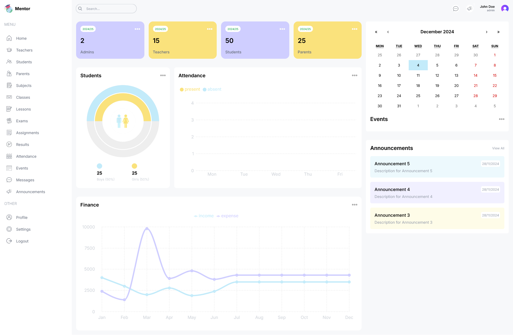

# Mentor School Management System

A comprehensive web application for managing educational institutions efficiently, built with cutting-edge web technologies.



## 🌟 Overview

Mentor is a powerful school management system designed to streamline administrative tasks, enhance communication, and provide insightful analytics for educational institutions.

## ✨ Features

- 🔐 **Robust User Authentication & Authorization**

  - Multi-role support (Admin, Teacher, Student, Parent)
  - Secure access control with Clerk authentication

- 📊 **Interactive Dashboards**

  - Real-time performance charts and analytics
  - Personalized insights for different user roles

- 👥 **Comprehensive User Management**

  - Detailed profiles for students, teachers, and parents
  - Easy onboarding and profile management

- 📚 **Academic Management**

  - Class and subject organization
  - Lesson planning and tracking
  - Curriculum management

- 📝 **Assignment & Exam Management**

  - Create, distribute, and grade assignments
  - Exam scheduling and result tracking

- 📅 **Event Calendar & Scheduling**

  - School-wide and personalized event tracking
  - Integrated scheduling system

- 📢 **Communication Tools**

  - Centralized announcement system
  - Cross-role communication channels

- ✔️ **Attendance Tracking**

  - Precise student attendance monitoring
  - Automated reporting

- 📊 **Performance Analytics**

  - Comprehensive student performance insights
  - Customizable reporting

- 📱 **Fully Responsive Design**
  - Seamless experience across devices
  - Mobile-friendly interface

## 🚀 Tech Stack

| Category             | Technology         |
| -------------------- | ------------------ |
| **Framework**        | Next.js 14         |
| **Language**         | TypeScript         |
| **Database**         | PostgreSQL         |
| **ORM**              | Prisma             |
| **Authentication**   | Clerk              |
| **Styling**          | Tailwind CSS       |
| **Charting**         | Recharts           |
| **Calendar**         | React Big Calendar |
| **Form Management**  | React Hook Form    |
| **File Storage**     | Cloudinary         |
| **Containerization** | Docker             |

## 🔧 Prerequisites

Before you begin, ensure you have the following installed:

- Node.js (v18 or later)
- pnpm
- Docker (optional, for containerized deployment)

## 🛠️ Installation & Setup

### 1. Clone the Repository

```bash
git clone https://github.com/AvishkaGihan/mentor-app.git
cd mentor-app
```

### 2. Install Dependencies

```bash
pnpm install
```

### 3. Environment Configuration

Create a `.env` file in the project root and add the following variables:

```
DATABASE_URL=your_postgresql_connection_string
NEXT_PUBLIC_CLERK_PUBLISHABLE_KEY=your_clerk_publishable_key
CLERK_SECRET_KEY=your_clerk_secret_key
NEXT_PUBLIC_CLERK_SIGN_IN_URL=/sign-in
NEXT_PUBLIC_CLERK_SIGN_UP_URL=/sign-up
NEXT_PUBLIC_CLERK_AFTER_SIGN_IN_URL=/dashboard
NEXT_PUBLIC_CLERK_AFTER_SIGN_UP_URL=/dashboard
NEXT_PUBLIC_CLOUDINARY_CLOUD_NAME=your_cloudinary_cloud_name
```

### 4. Database Setup

```bash
# Run migrations
pnpm prisma migrate dev --name init

# Seed the database
pnpm prisma db seed
```

### 5. Start Development Server

```bash
pnpm dev
```

Open [http://localhost:3000](http://localhost:3000) in your browser.

## 🐳 Docker Deployment

### Build Docker Image

```bash
docker build -t mentor-app .
```

### Run Docker Container

```bash
docker run -p 3000:3000 mentor-app
```

## 🤝 Contributing

Contributions are welcome! Please follow these steps:

1. Fork the repository
2. Create your feature branch (`git checkout -b feature/AmazingFeature`)
3. Commit your changes (`git commit -m 'Add some AmazingFeature'`)
4. Push to the branch (`git push origin feature/AmazingFeature`)
5. Open a Pull Request

## 📄 License

Distributed under the MIT License. See `LICENSE` for more information.

## 📧 Contact

Avishka Gihan - [avishkag18@gmail.com](mailto:avishkag18@gmail.com)

Project Link: [https://github.com/AvishkaGihan/mentor-app](https://github.com/AvishkaGihan/mentor-app)
